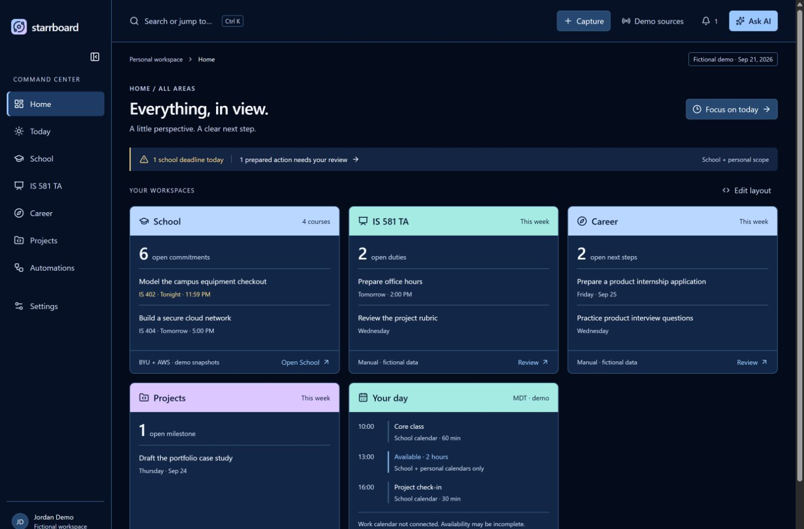
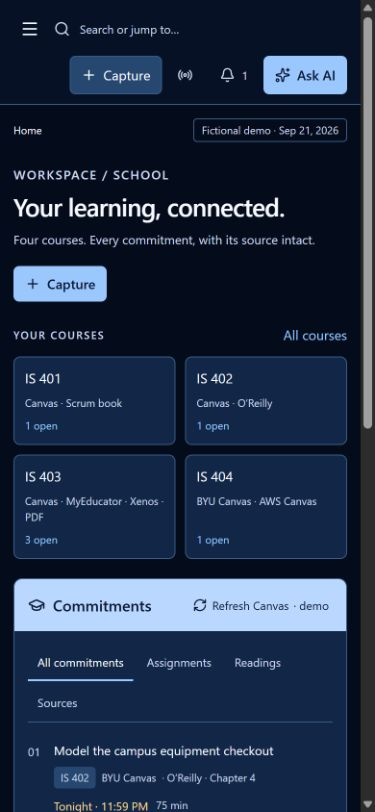
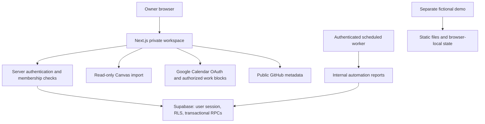

# Starrboard case study

## Problem and product decisions

Students managing multiple learning systems need one place to see deadlines and plan work. A zoomed-out Home complements focused workspaces. The design uses modular widgets, a collapsible command center, dark blue surfaces, and brighter task states.

Imported assignments remain provider-owned. Notes, estimates, custom readings, and completion planning belong to the user. Source freshness and failure states remain visible so a failed sync cannot masquerade as an empty schedule. A free, deterministic planner explains its workload and deadline rules.

## Private application architecture

The demo has no path to the private application's services. Rule changes, run claims, and report review use transactional database operations. Widget layouts are versioned to detect conflicting edits across devices.

## Limits

This is a personal project, not evidence of broad adoption or measured productivity gains. The planner is rule-based, not generative AI. External assistant integration and the deferred company workspace are not implemented. Calendar publication still has owner-deferred troubleshooting. The static demo shows a subset of the private product.

## Demonstration video plan (90 seconds)

1. 0–15s: Explain scattered deadlines and introduce the fictional Home overview.
2. 15–35s: Open School, filter coursework, and inspect a task's source and planning fields.
3. 35–50s: Add a fictional task, mark it complete, and open Today.
4. 50–65s: Move a widget and collapse the sidebar; show the phone layout.
5. 65–80s: Show the architecture diagram and distinguish the static demo from live integrations.
6. 80–90s: Explain the source-ownership boundary and next steps. Never record private tabs, account details, or credentials.

## Suggested resume bullets

- Built a modular personal command center with Next.js, TypeScript, and Supabase to organize coursework, reading progress, career activity, and project milestones.
- Integrated two Canvas sources and Google Calendar while separating imported records from user planning through ownership checks and transactional database operations.
- Created a credential-free static portfolio demo and automated tests covering data access, scheduling, conflict handling, and report automation.

Use only claims you can explain in an interview. No quantified business impact is claimed.
